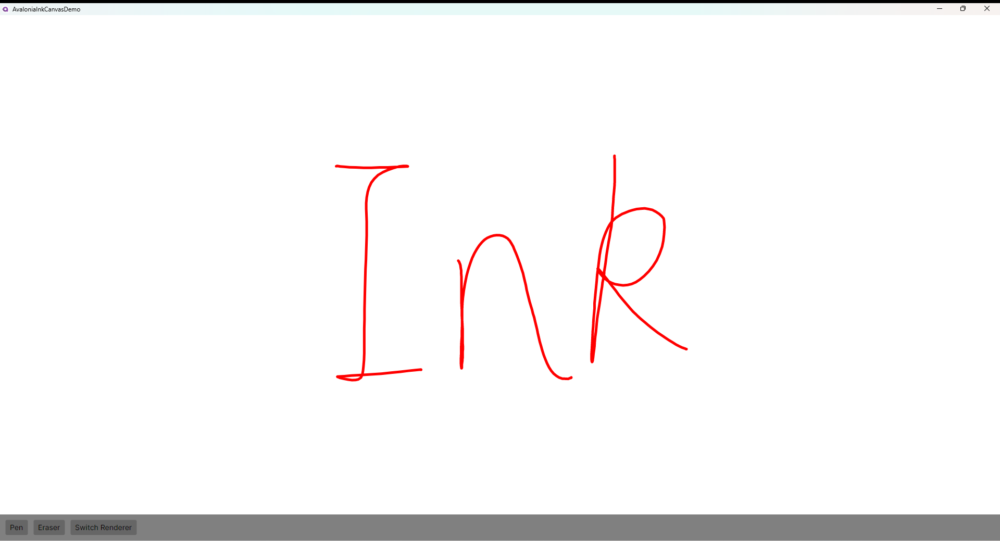

# DotNetCampus.InkCanvas

The InkCanvas control for .NET applications, such as Avalonia, providing a versatile canvas for handwriting and drawing.

书写笔迹画板

| Build | NuGet |
|--|--|
||[](https://www.nuget.org/packages/DotNetCampus.AvaloniaInkCanvas)|

[中文文档](./README_zh-CN.md)

This project originated from: https://github.com/AvaloniaUI/Avalonia/issues/1477



## Avalonia InkCanvas

### Quick Start

1. Install the NuGet package [`DotNetCampus.AvaloniaInkCanvas`](https://www.nuget.org/packages/DotNetCampus.AvaloniaInkCanvas)

   ```xml
     <ItemGroup>
       <PackageReference Include="DotNetCampus.AvaloniaInkCanvas" Version="1.0.0-alpha.2" />
     </ItemGroup>
   ```

2. Use the `InkCanvas` control in XAML:

   ```xml
   xmlns:inking="using:DotNetCampus.Inking"
   
   <inking:InkCanvas x:Name="InkCanvas"/>
   ```

3. Switch input modes in code:

    ```csharp
          // Switch to ink mode
          InkCanvas.EditingMode = InkCanvasEditingMode.Ink;
          // Switch to eraser mode
          InkCanvas.EditingMode = InkCanvasEditingMode.EraseByPoint;
    ```


### Advanced Usage

#### Switch stroke renderer

The library includes the following stroke renderers by default:

- `SimpleInkRender`: A simple and fast stroke renderer suitable for most scenarios. It uses a straightforward algorithm and performs well, but in some input cases strokes may showaliasing.
- `WpfForSkiaInkStrokeRenderer`: A renderer that uses WPF's stroke rendering algorithm adapted for Skia. It provides higher-quality strokes at the cost of performance. Its implementation is based on the WPF open-source codebase and is more complex.

Example of switching the stroke renderer:

```csharp
AvaloniaSkiaInkCanvasSettings settings = InkCanvas.SkiaInkCanvas.Settings;

// Use the WPF-based stroke renderer
settings.InkStrokeRenderer = new WpfForSkiaInkStrokeRenderer();

// Revert to the default (simple) stroke renderer
settings.InkStrokeRenderer = null;
```

Note: Using `WpfForSkiaInkStrokeRenderer` only utilizes the stroke rendering algorithm from the WPF open-source repository and does not depend on the WPF framework itself.

#### Handle stroke collected event

```csharp
        InkCanvas.StrokeCollected += (o, args) =>
        {
            var addedStroke = args.SkiaStroke; // Use addedStroke as needed
        };
```


### Handle stroke erased event

```csharp
        InkCanvas.StrokeErased += (o, args) =>
        {
            foreach (ErasedSkiaStroke erasedSkiaStroke in args.ErasingSkiaStrokeList)
            {
                if (erasedSkiaStroke.IsErased)
                {
                    // The stroke was erased; it may be split into multiple new strokes,
                    // or it may be fully erased resulting in 0 new strokes. 
                    IReadOnlyList<SkiaStroke> newStrokes = erasedSkiaStroke.NewStrokeList;

                    foreach (var skiaStroke in newStrokes)
                    {
                        // Process each resulting stroke segment
                    }
                }
                else
                {
                    // The stroke was not erased; it remains unchanged
                    SkiaStroke originalStroke = erasedSkiaStroke.OriginStroke;
                }
            }
        };
```


### Control eraser properties

Control eraser behavior via `AvaloniaSkiaInkCanvasSettings`, for example:

```csharp
        AvaloniaSkiaInkCanvasSettings settings = InkCanvas.SkiaInkCanvas.Settings;
        settings.EraserSize = new Size(100, 200);
```

### Save strokes as SVG image

You can export the strokes drawn on the `InkCanvas` to an SVG image format. Here's an example of how to do this:

```csharp
    private void SaveStrokeAsSvgButton_OnClick(object? sender, RoutedEventArgs e)
    {
        var saveFolder = Path.Join(AppContext.BaseDirectory, $"{DateTime.Now:yyyy-MM-dd_HH-mm-ss}");
        Directory.CreateDirectory(saveFolder);

        using var skPaint = new SKPaint();
        skPaint.IsAntialias = true;
        skPaint.Style = SKPaintStyle.Fill;

        for (var i = 0; i < InkCanvas.Strokes.Count; i++)
        {
            var saveSvgFile = Path.Join(saveFolder, $"{i}.svg");
            using var fileStream = File.Create(saveSvgFile);

            var stroke = InkCanvas.Strokes[i];

            var bounds = InkCanvas.Bounds.ToSKRect();
            using var skCanvas = SKSvgCanvas.Create(bounds, fileStream);

            skPaint.Color = stroke.Color;
            skCanvas.DrawPath(stroke.Path, skPaint);
        }
    }
```

# Contributing

[](https://github.com/dotnet-campus/DotNetCampus.InkCanvas/pulls)

If you would like to contribute, feel free to create a [Pull Request](https://github.com/dotnet-campus/DotNetCampus.InkCanvas/pulls), or give us [Bug Report](https://github.com/dotnet-campus/DotNetCampus.InkCanvas/issues/new).

# License

[](./LICENSE)